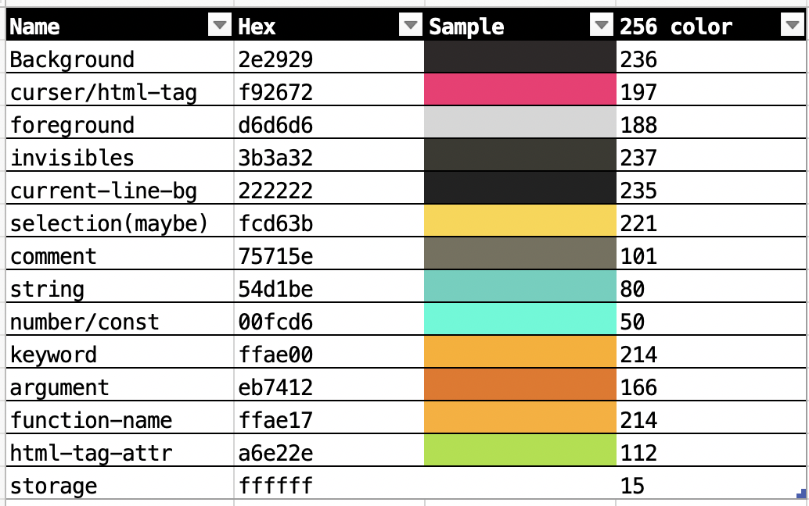
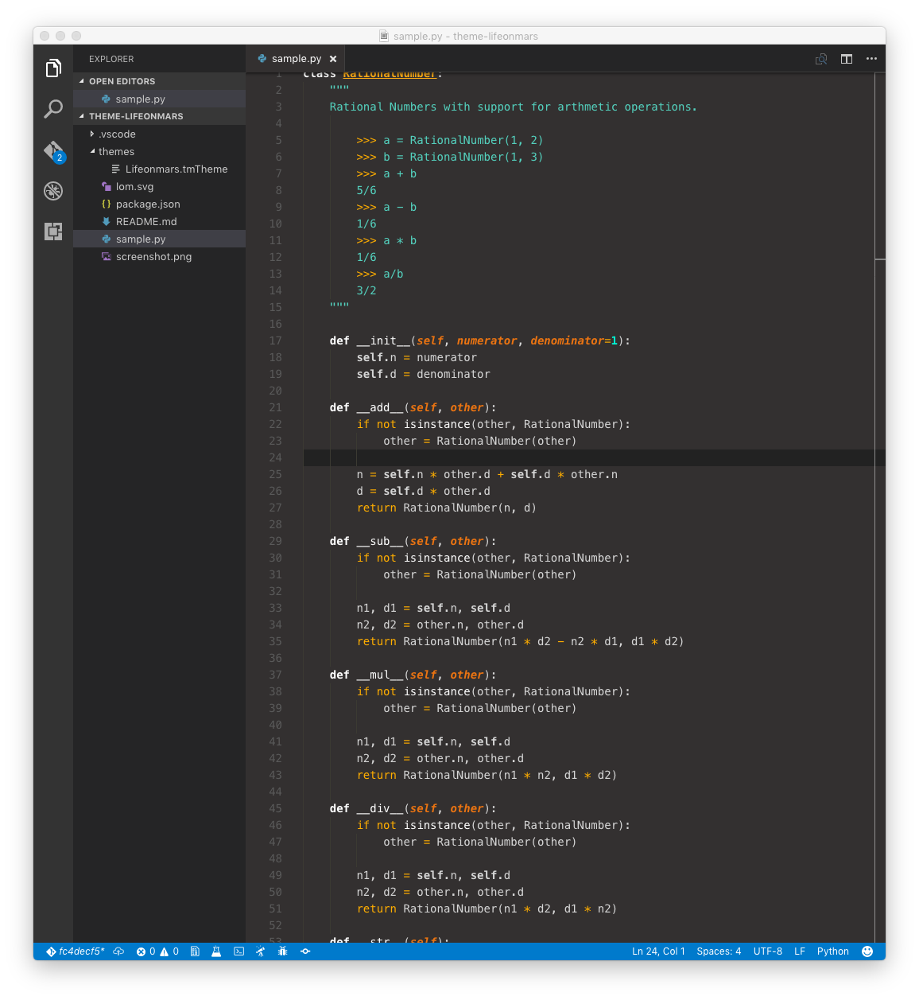
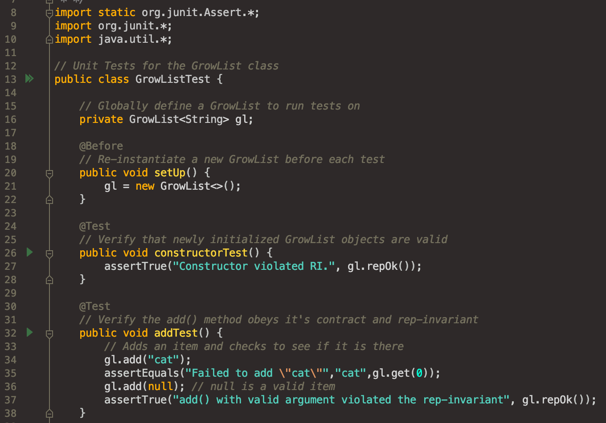

# README
## Code theme extension as proposed by the colonial Mars alliance specification 
* Standardized to meet spaceship lighting conditions
* Enhanced recognition under high UV exposure
## Palette

## VSCode

## IntelliJ

